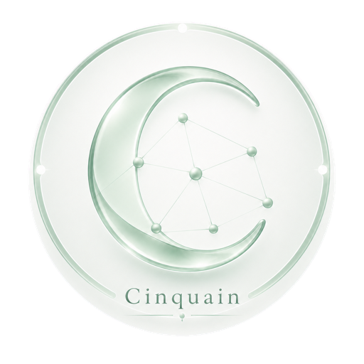

<p align="center">
  
</p>

# Cinquain

> Production-ready, web-guided Matrix homeserver deployment built on the latest
> Continuwuity. Cinquain `0.0.2` keeps the protocol core unmodified and packages
> automatic HTTPS, secure first-user onboarding, backups, upgrades, health
> checks, and a protected deployment panel.

Fresh Debian/Ubuntu or Fedora/RHEL server — one command, no browser step:

```bash
curl -fsSL https://raw.githubusercontent.com/Mcxiaocaibug/Cinquain/cinquain-v0.0.2/cinquain/bootstrap.sh \
  | sudo sh -s -- matrix.example.com admin@example.com
```

This installs the runtime, verifies the release bundle against its published
checksum, checks DNS and ports 80/443, obtains a certificate, waits until the
homeserver is healthy, and prints the single-use token for the first admin
account. Omit the domain and email to configure it from the protected web panel
instead, which is installed either way.

See the complete [Cinquain deployment guide](cinquain/README.md), or deploy from
an existing checkout with:

```bash
cd cinquain
./install.sh matrix.example.com admin@example.com
```

## Documentation / 文档

- [中文小白部署指南](cinquain/docs/GUIDE.zh-CN.md)
- [English beginner's deployment guide](cinquain/docs/GUIDE.en.md)
- [Complete deployment and operations reference](cinquain/README.md)

## Continuwuity core

<!-- ANCHOR: catchphrase -->

## A community-driven [Matrix](https://matrix.org/) homeserver in Rust

[](https://matrix.to/#/#continuwuity:continuwuity.org?via=continuwuity.org&via=ellis.link&via=explodie.org&via=matrix.org) [](https://matrix.to/#/#space:continuwuity.org?via=continuwuity.org&via=ellis.link&via=explodie.org&via=matrix.org)


<!-- ANCHOR_END: catchphrase -->

[continuwuity] is a Matrix homeserver written in Rust.
It's the official community continuation of the [conduwuit](https://github.com/girlbossceo/conduwuit) homeserver.

<!-- ANCHOR: body -->

[](https://forgejo.ellis.link/continuwuation/continuwuity) [](https://forgejo.ellis.link/continuwuation/continuwuity/stars) [](https://forgejo.ellis.link/continuwuation/continuwuity/issues?state=open) [](https://forgejo.ellis.link/continuwuation/continuwuity/pulls?state=open)

[](https://github.com/continuwuity/continuwuity) [](https://github.com/continuwuity/continuwuity/stargazers)

[](https://gitlab.com/continuwuity/continuwuity) [](https://gitlab.com/continuwuity/continuwuity/-/starrers)

[](https://codeberg.org/continuwuity/continuwuity) [](https://codeberg.org/continuwuity/continuwuity/stars)

### Why does this exist?

The original conduwuit project has been archived and is no longer maintained. Rather than letting this Rust-based Matrix homeserver disappear, a group of community contributors have forked the project to continue its development, fix outstanding issues, and add new features.

We aim to provide a stable, well-maintained alternative for current conduwuit users and welcome newcomers seeking a lightweight, efficient Matrix homeserver.

### Who are we?

We are a group of Matrix enthusiasts, developers and system administrators who have used conduwuit and believe in its potential. Our team includes both previous
contributors to the original project and new developers who want to help maintain and improve this important piece of Matrix infrastructure.

We operate as an open community project, welcoming contributions from anyone interested in improving continuwuity.

### What is Matrix?

[Matrix](https://matrix.org) is an open, federated, and extensible network for
decentralized communication. Users from any Matrix homeserver can chat with users from all
other homeservers over federation. Matrix is designed to be extensible and built on top of.
You can even use bridges such as Matrix Appservices to communicate with users outside of Matrix, like a community on Discord.

### What are the project's goals?

Continuwuity aims to:

- Maintain a stable, reliable Matrix homeserver implementation in Rust
- Improve compatibility and specification compliance with the Matrix protocol
- Fix bugs and performance issues from the original conduwuit
- Add missing features needed by homeserver administrators
- Provide comprehensive documentation and easy deployment options
- Create a sustainable development model for long-term maintenance
- Keep a lightweight, efficient codebase that can run on modest hardware

### Can I try it out?

Check out the [documentation](https://continuwuity.org) for installation instructions.

If you want to try it out as a user, we have some partnered homeservers you can use:
* You can head over to [https://federated.nexus](https://federated.nexus/) in your browser.
  * Hit the `Apply to Join` button. Once your request has been accepted, you will receive an email with your username and password.
  * Head over to [https://app.federated.nexus](https://app.federated.nexus/) and you can sign in there, or use any other matrix chat client you wish elsewhere.
  * Your username for matrix will be in the form of `@username:federated.nexus`, however you can simply use the `username` part to log in. Your password is your password.

* There's also [https://continuwuity.rocks/](https://continuwuity.rocks/). You can register a new account using Cinny via [this convenient link](https://app.cinny.in/register/continuwuity.rocks), or you can use Element or another matrix client *that supports registration*.

### What are we working on?

We're working our way through all of the issues in the [Forgejo project](https://forgejo.ellis.link/continuwuation/continuwuity/issues).

- [Packaging & availability in more places](https://forgejo.ellis.link/continuwuation/continuwuity/issues/747)
- [Appservices bugs & features](https://forgejo.ellis.link/continuwuation/continuwuity/issues?q=&type=all&state=open&labels=178&milestone=0&assignee=0&poster=0)
- [Improving compatibility and spec compliance](https://forgejo.ellis.link/continuwuation/continuwuity/issues?labels=119)
- Automated testing
- [Admin API](https://forgejo.ellis.link/continuwuation/continuwuity/issues/748)
- [Policy-list controlled moderation](https://forgejo.ellis.link/continuwuation/continuwuity/issues/750)

### Can I migrate my data from x?

- Conduwuit: Yes
- Conduit: No, database is now incompatible
- Grapevine: No, database is now incompatible
- Dendrite: No
- Synapse: No

We haven't written up a guide on migrating from incompatible homeservers yet. Reach out to us if you need to do this!

<!-- ANCHOR_END: body -->

## Contribution

### Development flow

- Features / changes must developed in a separate branch
- For each change, create a descriptive PR
- Your code will be reviewed by one or more of the continuwuity developers
- The branch will be deployed live on multiple tester's matrix servers to shake out bugs
- Once all testers and reviewers have agreed, the PR will be merged to the main branch
- The main branch will have nightly builds deployed to users on the cutting edge
- Every week or two, a new release is cut.

The main branch is always green!


### Policy on pulling from other forks

We welcome contributions from other forks of conduwuit, subject to our review process.
When incorporating code from other forks:

- All external contributions must go through our standard PR process
- Code must meet our quality standards and pass tests
- Code changes will require testing on multiple test servers before merging
- Attribution will be given to original authors and forks
- We prioritize stability and compatibility when evaluating external contributions
- Features that align with our project goals will be given priority consideration

<!-- ANCHOR: footer -->

#### Contact

Join our [Matrix room](https://matrix.to/#/#continuwuity:continuwuity.org?via=continuwuity.org&via=ellis.link&via=explodie.org&via=matrix.org) and [space](https://matrix.to/#/#space:continuwuity.org?via=continuwuity.org&via=ellis.link&via=explodie.org&via=matrix.org) to chat with us about the project!

<!-- ANCHOR_END: footer -->


[continuwuity]: https://forgejo.ellis.link/continuwuation/continuwuity
